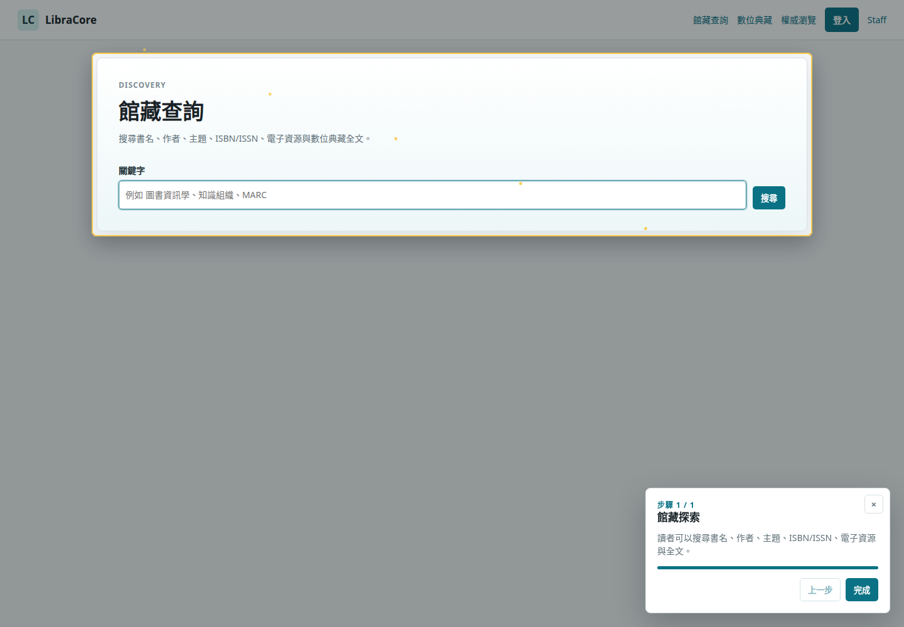
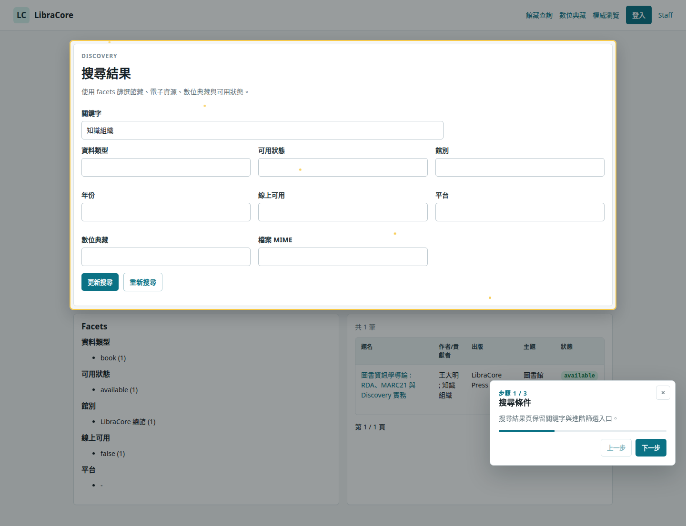
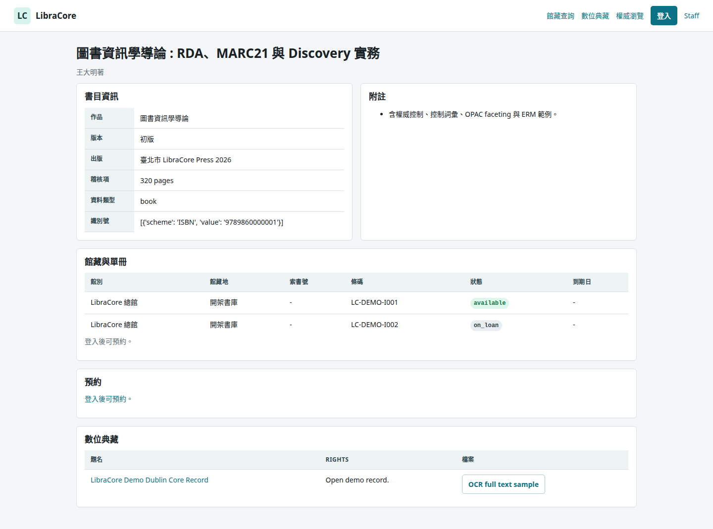
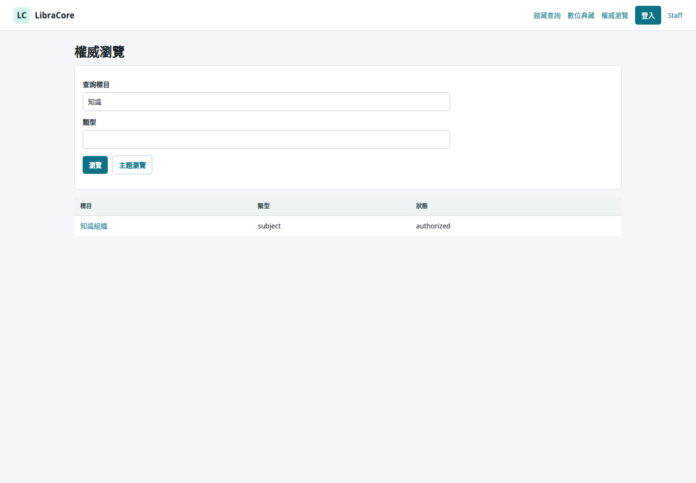
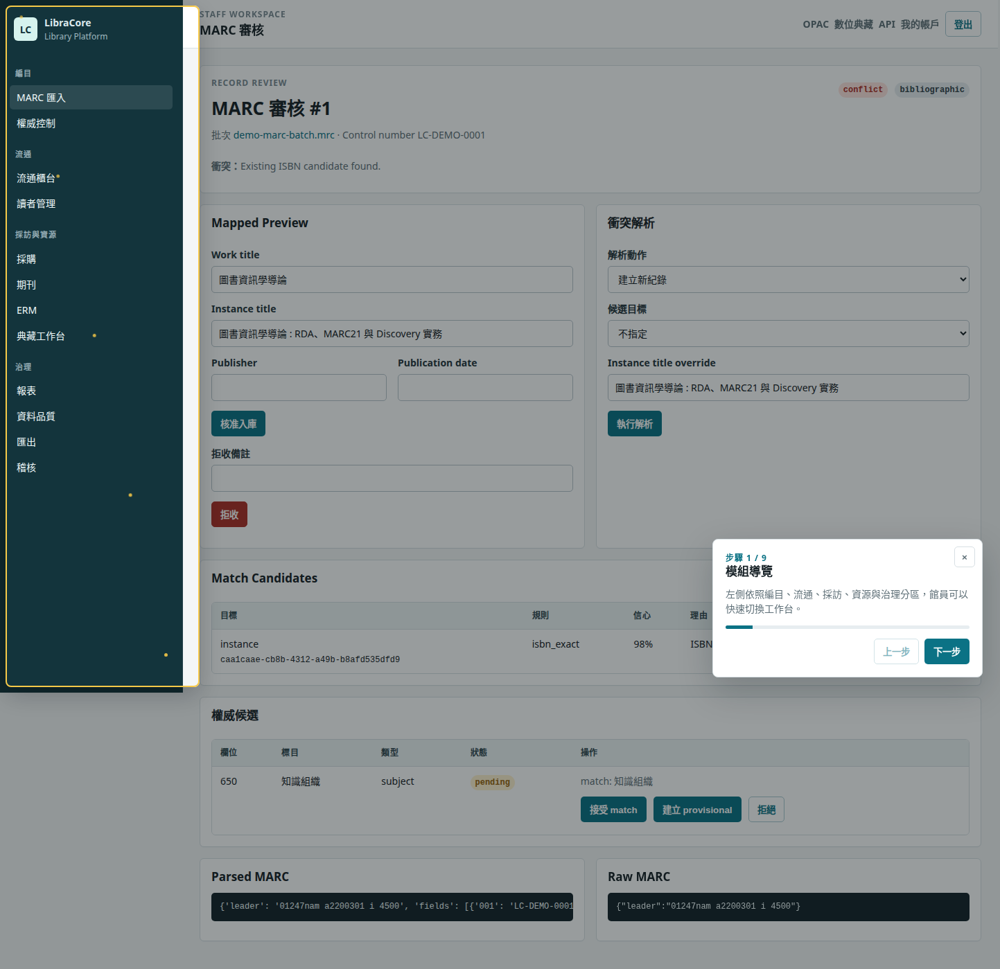
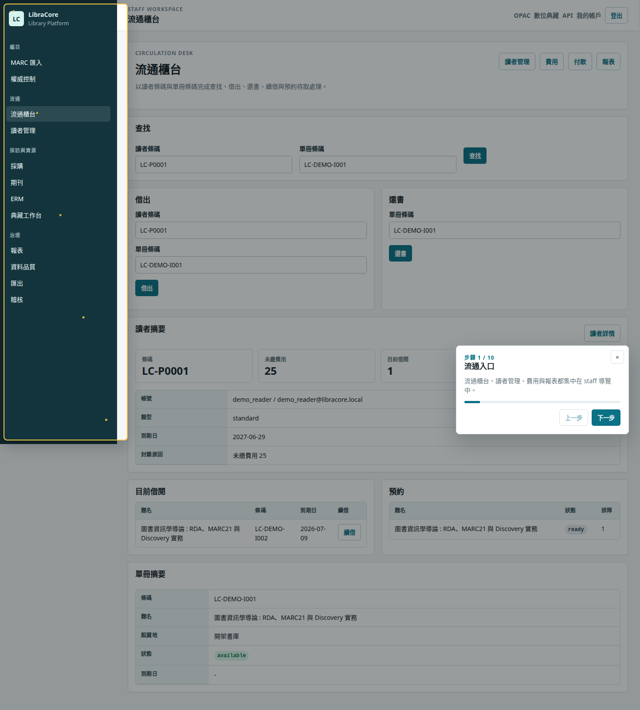
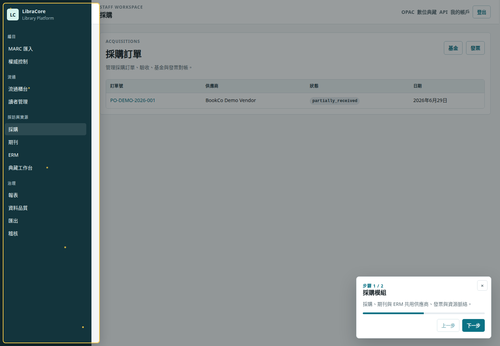
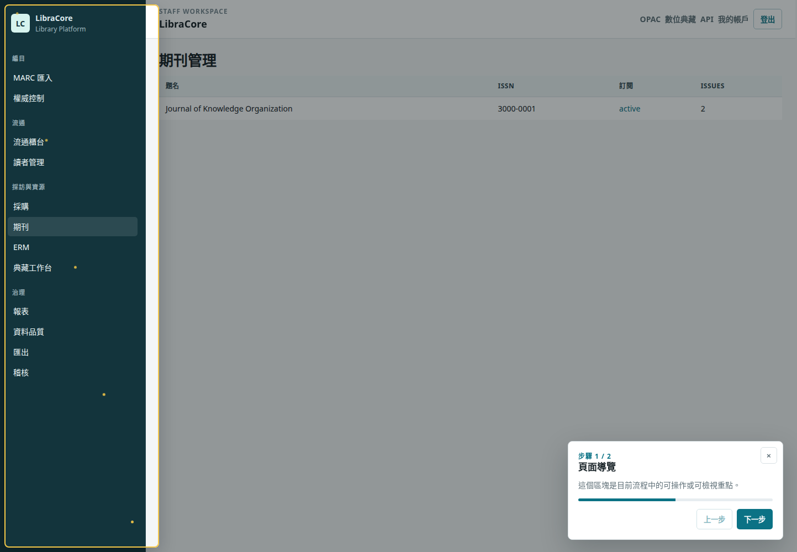
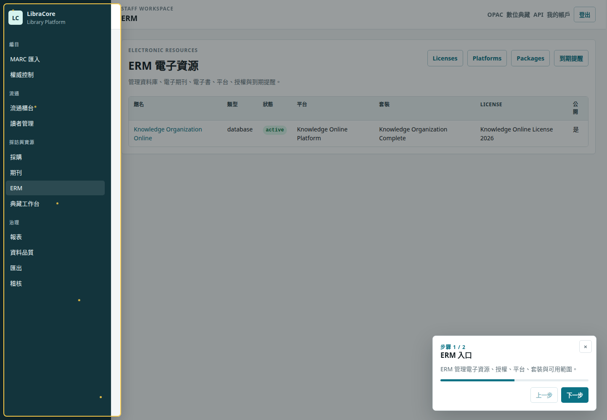
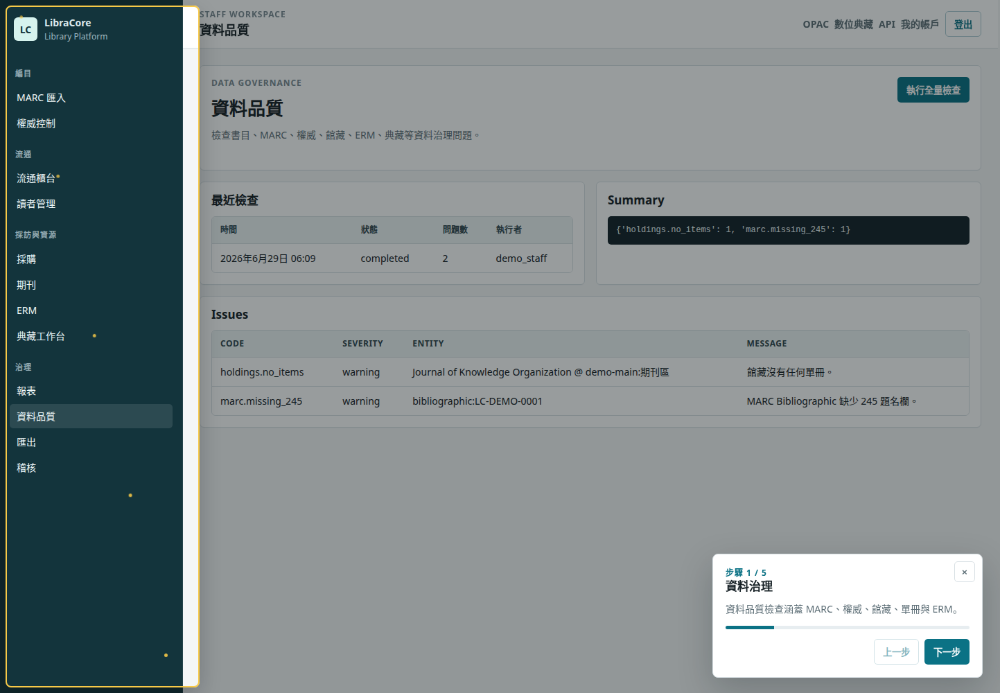

# LibraCore

LibraCore 是一套以圖書資訊學與知識組織概念為核心的 Django 圖書館資訊系統原型。它不是把資料簡化成單一 `Book` 表，而是明確拆分 Work、Expression、Instance、Item、MARC21、Authority、Holdings、Circulation、Acquisitions、Serials、ERM、Repository、Discovery 與治理稽核等領域邊界。

目前版本定位為可執行的整合式 MVP：可本機啟動完整 Django 系統，也提供 GitHub Pages 靜態展示頁與 Playwright 截圖、導覽影片作為 demo 素材。

## 連結

| 項目 | 連結 |
| --- | --- |
| 線上靜態 Demo | <https://justin21523.github.io/libracore/> |
| 中文專案頁 | <https://justin21523.github.io/zh-TW/projects/libracore/> |
| 英文專案頁 | <https://justin21523.github.io/en/projects/libracore/> |
| GitHub Repository | <https://github.com/Justin21523/libracore> |
| 導覽影片 | [libracore-guided-tour.webm](site/assets/videos/libracore-guided-tour.webm) |

## Demo 截圖

### Public OPAC / Discovery

| OPAC 首頁 | 搜尋結果 |
| --- | --- |
|  |  |

| 書目詳情 | 權威瀏覽 |
| --- | --- |
|  |  |

### Staff Workbench

| MARC 審核 | 流通櫃台 |
| --- | --- |
|  |  |

| 採購 | 期刊 |
| --- | --- |
|  |  |

| ERM | 資料品質 |
| --- | --- |
|  |  |

更多畫面請見 [site/assets/screenshots](site/assets/screenshots)。目前包含 OPAC、MARC 匯入、權威控制、流通、讀者、採訪、期刊、ERM、Repository、Analytics、Data Quality、Audit 與手機版畫面。

## 已完成範圍

- 書目模型：`Work`、`Expression`、`Instance`、`BibliographicRecord`，避免將「一本書」壓成單一資料表。
- MARC21：原始紀錄儲存、ISO2709 parser、MARCXML/JSON MARC 匯入、Leader/control/data field/subfield 解析、驗證、mapping preview、review-first approval。
- RDA / LRM / BIBFRAME 思維：以作品、表現形、載體與單冊分層，保留 agent、title、language、edition、publication、carrier、identifier 等欄位的正規化空間。
- 權威控制：AuthorityRecord、Authorized/Variant Access Point、see/see also、merge、deprecate、URI 驗證、公共權威與主題瀏覽。
- 控制詞彙與分類：ControlledVocabulary、VocabularyTerm、ClassificationScheme、ClassificationNumber、CallNumber。
- 館藏與單冊：Branch、Location、Holding、Item、條碼、館藏地、架位、流通狀態與 availability display。
- Discovery / OPAC：索引、keyword search、facets、權威標目與異名索引、CJK normalization、書目詳情、館藏狀態、線上可用資源。
- 流通：patron、loan、hold request、checkout、return、renew、hold queue、overdue fee、payment、waiver、staff circulation desk。
- 採訪：vendor、purchase request、order、order line、receiving、invoice、order line 連結或產生 Instance，驗收後產生 Holding / Item。
- 期刊：SerialTitle、Subscription、issue prediction、check-in、缺期、延遲、補刊、bound volume、期刊 holdings display。
- ERM：ElectronicResource、License、LicenseTerm、Platform、Package、Coverage、AccessUrl、ProxyConfig、trial/active/suspended/cancelled 狀態與 OPAC access links。
- 數位典藏：DigitalObject、FileAsset、Dublin Core 類 metadata、公開 repository 頁面與 OAI/SRU/export 基礎。
- 通知與讀者帳戶：借閱、歷史、預約、費用、通知、due soon、overdue、hold available、license expiry。
- 系統治理：AuditLog、RBAC 角色、資料品質檢查、匯出工作台、retention/anonymization command skeleton。
- UI / Demo：重新設計 staff/public 介面、內建 guided tour、小幫手導覽效果、Playwright 截圖與錄影腳本。
- 測試：MARC parser、匯入審核、權威、Discovery、OPAC、流通、採訪、期刊、ERM、Repository、治理、互通 API。

## 專案資料夾架構

```text
libracore/
├── apps/
│   ├── acquisitions/      # 採訪、訂單、驗收、發票、供應商
│   ├── analytics/         # 統計報表與執行紀錄
│   ├── authorities/       # 權威紀錄、標目、異名、關係、合併
│   ├── catalog/           # Work / Expression / Instance / BibliographicRecord
│   ├── circulation/       # 讀者、借閱、還書、續借、預約、費用
│   ├── core/              # audit、RBAC、資料品質、retention、seed commands
│   ├── discovery/         # OPAC 搜尋索引、CJK normalization、facets
│   ├── erm/               # 電子資源、授權、平台、套裝、coverage、proxy
│   ├── holdings/          # 分館、館藏地、holding、item、條碼
│   ├── interop/           # OAI-PMH、SRU、metadata export、circulation adapters
│   ├── marc/              # MARC21 parser、import batch、mapping、review workflow
│   ├── notifications/     # Email / in-app 通知模型與產生服務
│   ├── repository/        # 數位典藏物件、檔案資產、公開 repository
│   ├── serials/           # 期刊、訂閱、卷期預測、到刊、裝訂
│   ├── staff/             # 館員後台 URL 與 view orchestration
│   └── vocabularies/      # 控制詞彙、分類法、索書號
├── config/                # Django settings、root URL、ASGI/WSGI
├── docs/                  # 架構文件與補充說明
├── media/                 # 本機開發上傳、匯出與報表輸出
├── scripts/               # Playwright demo 截圖與錄影腳本
├── site/                  # GitHub Pages 靜態 demo 與媒體櫃
│   ├── assets/screenshots/
│   └── assets/videos/
├── static/                # 全站 CSS、guided tour JS、前端互動
├── templates/             # OPAC、staff、repository、login HTML templates
├── tests/                 # pytest 測試套件
├── manage.py
├── pyproject.toml
└── requirements.txt
```

## 重要檔案與功能說明

| 路徑 | 功能 |
| --- | --- |
| [config/settings.py](config/settings.py) | Django app 註冊、資料庫設定、DRF、static/media、login redirect 與測試友善設定。 |
| [config/urls.py](config/urls.py) | 掛載 OPAC、staff、repository、authority、interop、API 與 admin 路由。 |
| [apps/catalog/models.py](apps/catalog/models.py) | 核心 bibliographic entity model，定義 Work、Expression、Instance、BibliographicRecord 與關聯。 |
| [apps/marc/parser.py](apps/marc/parser.py) | ISO2709 MARC21 parser，處理 leader、directory、control fields、data fields、indicators、subfields。 |
| [apps/marc/mapping.py](apps/marc/mapping.py) | MARC Bibliographic 欄位到內部 Work / Instance / BibliographicRecord 的 mapping。 |
| [apps/marc/review_services.py](apps/marc/review_services.py) | MARC 匯入後的審核、核准、拒絕、建立或連結書目資料。 |
| [apps/authorities/services.py](apps/authorities/services.py) | 權威標目、異名、關係、棄用、合併與資料一致性服務。 |
| [apps/discovery/indexing.py](apps/discovery/indexing.py) | 將已核准書目、館藏、權威、ERM availability 轉成 Discovery index document。 |
| [apps/discovery/search.py](apps/discovery/search.py) | Keyword search、facets、排序、SQLite fallback 與搜尋結果組裝。 |
| [apps/discovery/cjk.py](apps/discovery/cjk.py) | 中文、繁簡、羅馬化與 CJK 搜尋 normalization 輔助。 |
| [apps/circulation/services.py](apps/circulation/services.py) | 借出、歸還、續借、預約、待取、逾期與流通 audit 的核心交易邏輯。 |
| [apps/circulation/policies.py](apps/circulation/policies.py) | 流通政策、可借天數、續借與逾期費規則。 |
| [apps/acquisitions/services.py](apps/acquisitions/services.py) | 採購狀態流轉、驗收、order line 產生 Holding / Item、invoice reconciliation。 |
| [apps/serials/prediction.py](apps/serials/prediction.py) | 期刊卷期 enumeration / chronology 預測。 |
| [apps/serials/services.py](apps/serials/services.py) | 到刊 check-in、缺期、延遲、補刊、裝訂與館藏文字顯示。 |
| [apps/erm/services.py](apps/erm/services.py) | 電子資源狀態、授權條款、coverage、access URL 與 proxy URL 產生。 |
| [apps/repository/services.py](apps/repository/services.py) | 數位物件與檔案資產 metadata、公開顯示與 export 資料組裝。 |
| [apps/interop/oai.py](apps/interop/oai.py) | OAI-PMH provider 基礎流程。 |
| [apps/interop/sru.py](apps/interop/sru.py) | SRU search/retrieve 基礎流程。 |
| [apps/core/audit.py](apps/core/audit.py) | 統一 AuditLog 寫入工具。 |
| [apps/core/permissions.py](apps/core/permissions.py) | Staff role / permission group 與高風險操作權限檢查。 |
| [apps/core/data_quality.py](apps/core/data_quality.py) | 書目、MARC、權威、item、holding、ERM 的資料品質檢查。 |
| [apps/core/retention.py](apps/core/retention.py) | 借閱歷史、通知與 audit retention/anonymization 輔助。 |
| [apps/staff/views.py](apps/staff/views.py) | 館員後台各工作台 view orchestration。 |
| [templates/base.html](templates/base.html) | 公開頁與 staff 後台共用 shell、導覽、sidebar、message area。 |
| [static/css/libracore.css](static/css/libracore.css) | LibraCore 視覺系統、RWD layout、staff table/form、OPAC 與 guided tour 樣式。 |
| [static/js/libracore-ui.js](static/js/libracore-ui.js) | sidebar、active nav、message dismissal、guided tour 步驟與 highlight 效果。 |
| [scripts/capture_portfolio_demo.py](scripts/capture_portfolio_demo.py) | 使用 Playwright 自動操作網站、截圖並錄製 demo 影片。 |
| [apps/core/management/commands/seed_portfolio_demo.py](apps/core/management/commands/seed_portfolio_demo.py) | 建立 portfolio demo 所需的 staff、reader、書目、館藏、MARC、權威、ERM、期刊等資料。 |
| [.github/workflows/deploy-github-pages.yml](.github/workflows/deploy-github-pages.yml) | 將 `site/` 發布到 GitHub Pages。 |

## 領域模型摘要

```text
Work
└── Expression
    └── Instance / Manifestation
        ├── BibliographicRecord
        │   └── MarcRecord
        ├── Holding
        │   └── Item
        └── ElectronicResource / Coverage / AccessUrl

AuthorityRecord
├── AuthorizedAccessPoint
├── VariantAccessPoint
└── AuthorityRelation

ControlledVocabulary
└── VocabularyTerm

ClassificationScheme
└── ClassificationNumber
    └── CallNumber

Patron
├── Loan
├── HoldRequest
├── FineFee
└── Notification
```

這個分層讓 MARC21、RDA、BIBFRAME、Discovery 與流通資料可以各自保有來源與生命週期，不會因為 UI 需要顯示「一本書」而破壞 bibliographic control。

## API 與主要頁面

| 範圍 | 路徑 |
| --- | --- |
| OPAC 首頁 | `/` |
| 搜尋 | `/search/` |
| 書目頁 | `/records/<uuid>/` |
| 權威瀏覽 | `/authorities/` |
| 主題瀏覽 | `/authorities/subjects/` |
| Repository | `/repository/` |
| 讀者帳戶 | `/account/` |
| 編目工作台 | `/staff/cataloging/imports/` |
| 權威工作台 | `/staff/authorities/` |
| 流通櫃台 | `/staff/circulation/` |
| 採購工作台 | `/staff/acquisitions/` |
| 期刊管理 | `/staff/serials/` |
| ERM | `/staff/erm/` |
| 數位典藏後台 | `/staff/repository/` |
| Analytics | `/staff/analytics/` |
| Data Quality | `/staff/data-quality/` |
| Audit Log | `/staff/audit/` |
| DRF API | `/api/` |
| OAI / SRU | `/oai/`、`/sru/` |

API 實作分散於各 app 的 `api.py` 與 `serializers.py`，路由由 [config/urls.py](config/urls.py) 統一掛載。

## 本機啟動

```bash
python3 -m pip install -r requirements.txt
python3 manage.py migrate
python3 manage.py seed_libracore
python3 manage.py seed_portfolio_demo
python3 manage.py runserver
```

預設使用 SQLite。若要改用 PostgreSQL，設定 `DATABASE_URL` 為 `postgres` 開頭，並提供 `POSTGRES_DB`、`POSTGRES_USER`、`POSTGRES_PASSWORD`、`POSTGRES_HOST`、`POSTGRES_PORT`。

Demo 帳號：

| 角色 | 帳號 | 密碼 |
| --- | --- | --- |
| Staff | `demo_staff` | `demo_staff_pass` |
| Reader | `demo_reader` | `demo_reader_pass` |

## 測試與驗收

```bash
python3 manage.py check
python3 manage.py makemigrations --check --dry-run
pytest -q
```

Playwright demo 截圖與錄影：

```bash
python3 scripts/capture_portfolio_demo.py --base-url http://127.0.0.1:8000 --out artifacts/portfolio-demo
```

目前測試覆蓋：

- MARC parser、MARC import batch、MARC review workflow。
- Work / Instance / Item / Loan 的資料邊界。
- Cataloging workbench API 與 staff views。
- Authority service、API、merge、deprecate、browse。
- Discovery indexing、search API、OPAC views。
- Circulation service、staff circulation desk、patron portal。
- Acquisitions、serials、ERM、repository workflows。
- Notifications、governance、data quality、audit、interop OAI/SRU/export。

## GitHub Pages 靜態展示

`site/` 是部署到 GitHub Pages 的靜態 portfolio demo，不是完整 Django runtime。它包含：

- [site/index.html](site/index.html)：展示頁主體。
- [site/styles.css](site/styles.css)：靜態展示頁樣式。
- [site/assets/screenshots](site/assets/screenshots)：Playwright 產生的 demo 截圖。
- [site/assets/videos](site/assets/videos)：guided tour 錄影與 poster。

部署由 [.github/workflows/deploy-github-pages.yml](.github/workflows/deploy-github-pages.yml) 執行，推送到 `main` 後會重新發布 GitHub Pages。

## 目前邊界與注意事項

- 這是可執行 MVP 與展示版，不是 production-ready LSP。正式上線仍需 PostgreSQL、背景工作佇列、集中式搜尋引擎、正式備份、資安 hardening 與 observability。
- MARC21、BIBFRAME、RDA、Dublin Core 的 mapping 目前是工程化骨架，後續要依實際館藏政策、編目規則與資料來源擴充。
- RDA Toolkit、DDC、部分分類法與外部 vocabulary 可能有授權限制，不能把受限內容直接 seed 到公開 repo。
- Discovery 現階段支援 SQLite fallback 與 PostgreSQL FTS 策略；大型資料量應接 OpenSearch、Elasticsearch 或 Meilisearch。
- SIP2、NCIP、Z39.50、完整 OpenURL resolver 目前是預留整合邊界，尚未做完整 production adapter。
- `media/`、`db.sqlite3` 與匯出成果只適合本機 demo，不應作為正式資料保存策略。
